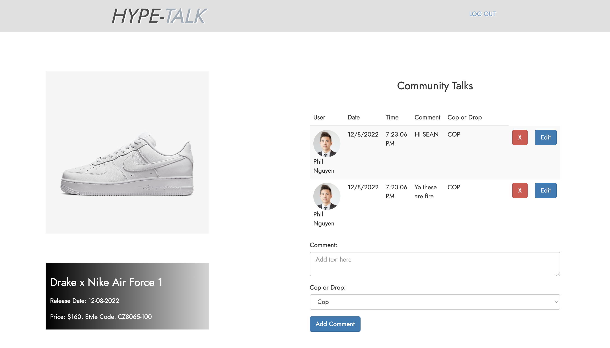
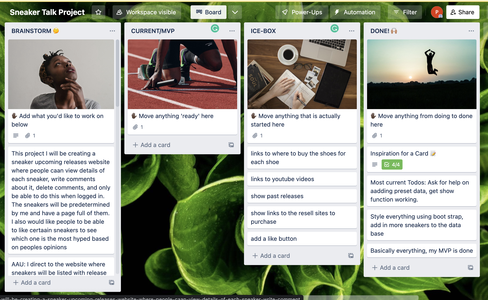
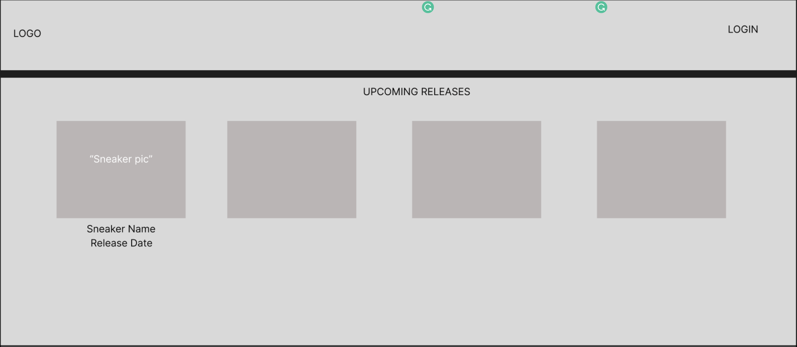
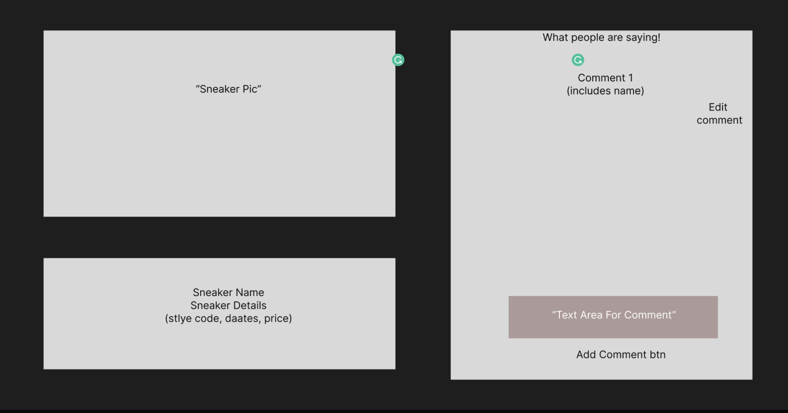
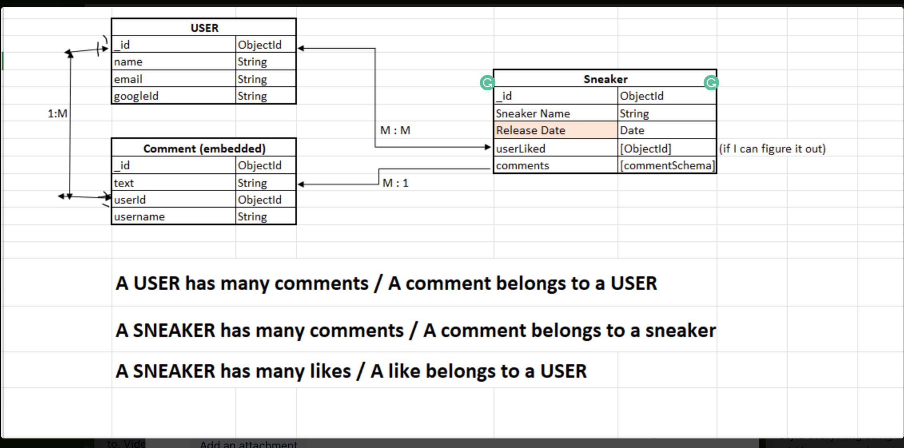

## HYPE-TALK
# Sneaker information created by a sneakerhead to stay up to date on all the upcoming releases and talk amongst the community!

Project Link -------> https://byzantium-pangolin-cuff.cyclic.app/sneakers <-----

This projects is a full stack application using node.js, express, mongoDB, mongoose, HTML, JavaScript, Bootstrap, oAuth from Google, and CSS!

It has full CRUD operations created by yours truly.

# Landing Page

# Show Page (CRUD)

# How it works

Anybody can view upcoming releases on this application. The key to contributing to the discussion is logging in with google. Features like commenting, editing, and deleting are locked to a specific user after they loggedd in.

A user may not add in their own sneakers it is up to the administration to do that to avoid any interupptions. The sneakers are stored in a database and pulled into the site.

The database can be updated whenver needed.

# Planning
Utilized Trello for user stories, ice box items, and to stay organized 

# Wire Frame

# ERD Diagram

